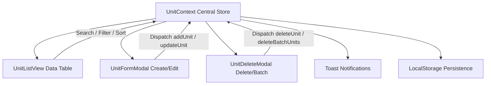

# 🏗️ Arsitektur Teknis Master Data Satuan Ukur

Dokumentasi arsitektur sistem, pengelolaan state, skema model data, dan alur CRUD untuk **Master Data Satuan Ukur MVP**.

---

## 1. Arsitektur State & Alur Data (Data Flow)

Aplikasi mengimplementasikan **Single Source of Truth** menggunakan React Context (`UnitContext`) dengan penyimpanan otomatis ke `localStorage` browser.



---

## 2. Skema Model Data

### Model `Unit` (Satuan Ukur)
```typescript
interface Unit {
  id: string;          // ID unik terformat, contoh: 'UOM-001'
  name: string;        // Nama Satuan Ukur (contoh: 'Kilogram', 'Pcs') - REQUIRED
  createdAt: string;   // ISO 8601 Timestamp
  updatedAt: string;   // ISO 8601 Timestamp
}
```

---

## 3. Logika Bisnis & Validasi CRUD

1. **Validasi Input**:
   - Nama satuan tidak boleh kosong atau hanya berupa spasi (*whitespace*).
   - Validasi keunikan nama (*case-insensitive*): Jika nama sudah ada di daftar, sistem akan menampilkan pesan peringatan dan menolak penambahan duplikat.
2. **Pencarian Real-time**:
   - Filter instan berdasarkan nama satuan ukur atau kode ID.
3. **Paginasi Dinamis**:
   - Kontrol pilihan jumlah data per halaman (5, 8, 10, 20) dan navigasi halaman pertama/terakhir.
4. **Hapus Massal (Batch Delete)**:
   - Pengguna dapat memilih beberapa satuan ukur dengan checkbox dan menghapusnya sekaligus secara aman melalui modal konfirmasi.
